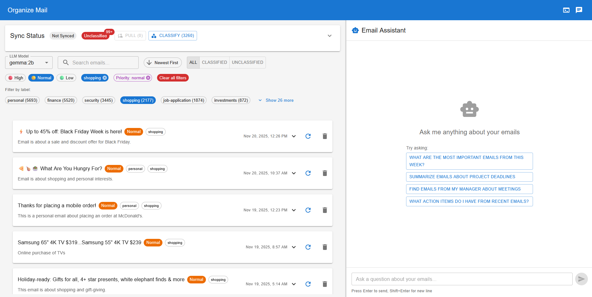

# organize-mail

AI-powered email organization system with intelligent classification, RAG-powered chat, and multi-provider LLM support.

## Overview

Organize Mail is a full-stack application that helps you manage your inbox intelligently. It uses AI to automatically classify emails, provides a conversational interface to search through your email history, and offers real-time monitoring of classification activities.

<!-- TODO: Add demo.gif or screenshot here -->

*Application demo showing email classification and chat interface*

## Key Features

- **Intelligent Email Classification**: Automatically categorize emails by type (finance, security, meetings, etc.) and priority
- **RAG-Powered Chat**: Ask questions about your email history using retrieval-augmented generation
- **Real-Time Logging**: WebSocket-based log viewer for monitoring system activity
- **Multi-Provider LLM Support**: Choose from OpenAI, Anthropic, Ollama (local), custom commands, or rule-based classification
- **Gmail Integration**: Pull messages via Gmail API with batch sync (OAuth + refresh token)
- **Flexible Storage**: SQLite or PostgreSQL backend with classification history and audit trails
- **REST API**: FastAPI backend with comprehensive endpoints for messages, classifications, and RAG queries
- **Modern Frontend**: React + TypeScript UI with Material-UI components, resizable panels, and real-time updates

## Project Structure

```
organize-mail/
├── backend/                 # Python FastAPI backend
│   ├── src/
│   │   ├── api.py          # REST API endpoints
│   │   ├── clients/        # Gmail API client
│   │   ├── jobs/           # Background jobs (classification, sync)
│   │   ├── models/         # Data models (Message, ClassificationRecord)
│   │   ├── services/       # LLM processor, RAG engine, query handlers
│   │   ├── storage/        # Storage layer (SQLite, PostgreSQL)
│   │   └── utils/          # HTML/CSS sanitizers, email processing
│   └── tests/              # Pytest test suite
├── frontend/               # React + TypeScript UI
│   ├── src/
│   │   ├── components/     # React components (EmailList, etc.)
│   │   └── types/          # TypeScript type definitions
│   └── tests/              # Vitest test suite
├── llm/                    # Local LLM deployment (Ollama configs)
└── docs/                   # Architecture & runbooks
```

## Quick Start

1. **Backend Setup**
   ```bash
   cd backend
   python -m venv .venv
   source .venv/bin/activate
   pip install -r requirements.txt
   uvicorn src.api:app --reload
   ```

2. **Frontend Setup**
   ```bash
   cd frontend
   npm install
   npm run dev
   ```

3. **Configure Gmail Integration**
   - Set up OAuth credentials in Google Cloud Console
   - Set environment variables (see [Authentication Setup](#authentication-setup))
   - Complete the OAuth flow in the app

See [Backend README](backend/README.md) and [Frontend README](frontend/README.md) for detailed setup instructions.

## Authentication Setup

The application uses OAuth 2.0 to access your Gmail. Follow these steps:

### 1. Create Google OAuth Credentials

1. Go to [Google Cloud Console Credentials](https://console.cloud.google.com/apis/credentials)
2. Create a new project or select existing one
3. Enable the **Gmail API**
4. Create OAuth 2.0 Client ID (Web application type)
5. Add authorized redirect URI: `http://localhost:8000/api/auth/callback`

### 2. Set Environment Variables

```bash
# Required
export JWT_SECRET=$(openssl rand -hex 32)
export GOOGLE_CLIENT_ID="your_client_id.apps.googleusercontent.com"
export GOOGLE_CLIENT_SECRET="your_client_secret"

# Optional - restrict to your email only (recommended for self-hosted)
export ALLOWED_EMAIL="your.email@gmail.com"
```

### 3. Run Database Migration (PostgreSQL only)

```bash
cd backend
python run_migration.py src/storage/migrations/004_add_oauth_tokens.sql
```

### 4. Authenticate

1. Start the backend and frontend servers
2. Open http://localhost:5173
3. Click "Sign in with Google"
4. Grant Gmail read permissions

For detailed documentation, see [docs/AUTH_IMPLEMENTATION_PLAN.md](docs/AUTH_IMPLEMENTATION_PLAN.md).

## TODO

- [x] **OAuth Integration**: Migrate from manual refresh token to proper OAuth flow
- [ ] **Gmail Pub/Sub**: Add real-time email notifications via Gmail Pub/Sub webhooks

## Documentation

- [Backend README](backend/README.md) - API, jobs, storage, and RAG details
- [Frontend README](frontend/README.md) - UI components, logging, and development
- [Agents & LLM Components](agents.md) - Background jobs, LLM processors, and RAG engine
- [Query Flow](docs/QUERY_FLOW.md) - Complete query pipeline and classification
- [RAG Documentation](docs/RAG_DOC.md) - Retrieval-augmented generation system
- [Storage Schema](docs/STORAGE_SCHEMA.md) - Database schema and migrations

## License

See [LICENSE](LICENSE)
